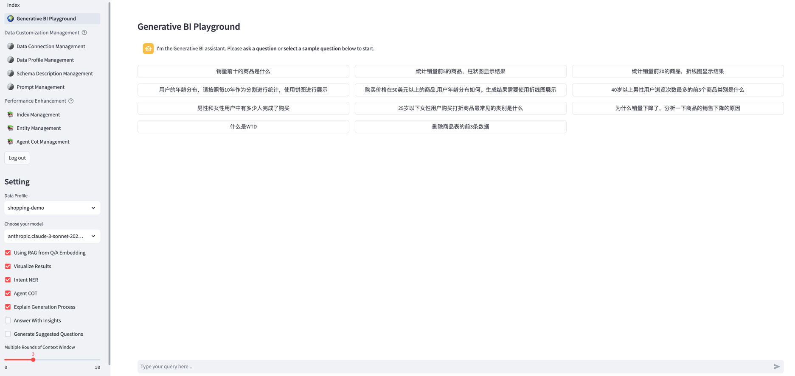
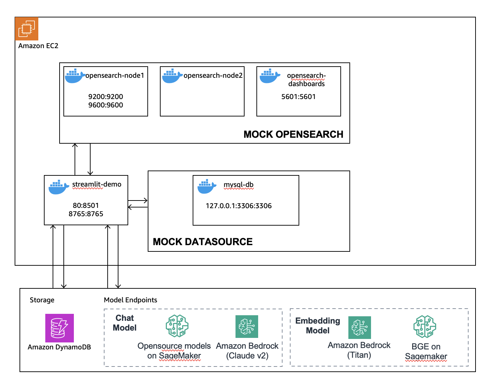
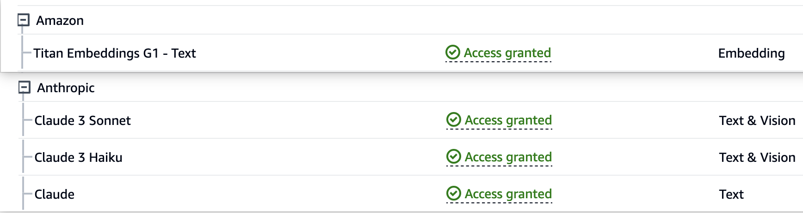

# Guidance for Retail Analytics with Generative AI on AWS

[中文文档](README_CN.md)

The Guidance title should be consistent with the title established first in Alchemy.

## Table of Content

List the top-level sections of the README template, along with a hyperlink to the specific section.

### Required

1. [Overview](#overview-required)
    - [Cost](#cost)
2. [Prerequisites](#prerequisites-required)
    - [Operating System](#operating-system-required)
3. [Deployment Steps](#deployment-steps-required)
4. [Deployment Validation](#deployment-validation-required)
5. [Running the Guidance](#running-the-guidance-required)
6. [Next Steps](#next-steps-required)
7. [Cleanup](#cleanup-required)

***Optional***

8. [Revisions](#revisions-optional)
9. [Notices](#notices-optional)
10. [Authors](#authors-optional)

## Overview

This is a comprehensive framework designed to enable Generative BI capabilities on customized data sources (RDS/Redshift) hosted on AWS. It offers the following key features:
- Text-to-SQL functionality for querying customized data sources using natural language.
- User-friendly interface for adding, editing, and managing data sources, tables, and column descriptions.
- Performance enhancement through the integration of historical question-answer ranking and entity recognition.
- Intuitive question-answering UI that provides insights into the underlying Text-to-SQL mechanism.
- Simple agent design interface for handling complex queries through a conversational approach.




_Architecture Diagram_
 
### Cost

As of May, 2024, the cost for running this Guidance with the default settings in the _us-west-2_ is approximately $476.74 per month for processing 2000 requests.

### Sample Cost Table

The following table provides a sample cost breakdown for deploying this Guidance with the default parameters in the US East (N. Virginia) Region for one month.

| AWS service  | Dimensions | Cost [USD] per Month |
| ----------- | ------------ | ------------ |
| Amazon EC2 | 1 instance t3.large | $ 60.74 |
| Amazon DynamoDB | 25 provisioned write & read capacity units per month | $ 0.00 |
| Amazon Bedrock | 2000 requests per month, with each request consuming 10000 input tokens and 1000 output tokens | $ 416.00 |

## Prerequisites

### Operating System

**Example:**
“These deployment instructions are optimized to best work on **<Amazon Linux 2023 AMI>**.  Deployment in another OS may require additional steps.”

### AWS account requirements (If applicable)

**Example:** “This deployment requires you have public ACM certificate available in your AWS account”

**Example resources:**
- VPC
- IAM role with specific permissions
- Amazon Bedrock
- Amazon EC2
- Amazon DynamoDB

### Supported Regions

us-west-2, us-east-2, us-east-1, ap-south-1, ap-southeast-1, ap-southeast-2, ap-northeast-1, eu-central-1, eu-west-1, eu-west-3, or any other region that supports the services (bedrock) used in the Guidance.

## Deployment Steps

### 1. Prepare EC2 Instance
Create an EC2 with following configuration:
    - OS Image (AMI): Amazon Linux 2023
    - Instance type: t3.large or higher
    - VPC: use default one and choose a public subnet
    - Security group: Allow access to 22, 80 port from anywhere (Select "Allow SSH traffic from Anywhere" and "Allow HTTP traffic from the internet")
    - Storage (volumes): 1 GP3 volume(s) - 30 GiB

### 2. Config Permission

2.1 IAM Role's permission

Create a new IAM role with name genbirag-service-role and settings below:
   - Trusted entity type: AWS Service
   - Service: EC2
   - Use Case: EC2 - Allows EC2 instances to call AWS services on your behalf.

Skip "Add permission" and create this role first.

After the role is created, and then add permission by creating inline policy as below:
```json
{
    "Version": "2012-10-17",
    "Statement": [
        {
            "Sid": "VisualEditor0",
            "Effect": "Allow",
            "Action": [
                "bedrock:*",
                "dynamodb:*"
            ],
            "Resource": "*"
        }
    ]
}
```

Finally, Bind this IAM instance profile (IAM Role) to your EC2 instance.

2.2 Amazon Bedrock's Model Permission

Make sure you have enabled model access in AWS Console in us-west-2 (Oregon) region for Anthropic Claude model and Amazon Titan embedding model.


### 3. Install Docker and Docker Compose

Log in to the EC2 instance using SSH command as the ec2-user user or use the AWS EC2 Instance Connect feature in the EC2 console to log in to the command line. 

In the session, execute the following commands. **Note: Execute each command one line at a time.**

If you are not this user, you can switch with the following command: 
```bash
sudo su - ec2-user
```

```bash  
# Install components
sudo dnf install docker python3-pip git -y && pip3 install -U awscli && pip3 install docker-compose

# Fix docker python wrapper 7.0 SSL version issue  
pip3 install docker==6.1.3

# Configure components
sudo systemctl enable docker && sudo systemctl start docker && sudo usermod -aG docker $USER

# Exit the terminal
exit
```

### 4. Install the Demo Application

Reopen a terminal session and continue executing the following commands:

Note: Execute each command one line at a time.

```bash
# Log in as user ec2-user

# Configure OpenSearch server parameters
sudo sh -c "echo 'vm.max_map_count=262144' > /etc/sysctl.conf" && sudo sysctl -p

# Clone the code
git clone https://github.com/aws-samples/generative-bi-using-rag.git

# Config the Environment Variable in .env file, modify AWS_DEFAULT_REGION to the region same as the EC2 instance.
cd generative-bi-using-rag/application && cp .env.template .env 

# Build docker images locally
docker-compose build

# Start all services
docker-compose up -d

# Wait 3 minutes for MySQL and OpenSearch to initialize
sleep 180
```

### 5. Initialize MySQL

In the terminal, continue executing the following commands:

```bash
cd initial_data && wget https://github.com/fengxu1211/generative-bi-using-rag/raw/demo_data/application/initial_data/init_mysql_db.sql.zip

unzip init_mysql_db.sql.zip && cd ..

docker exec nlq-mysql sh -c "mysql -u root -ppassword -D llm  < /opt/data/init_mysql_db.sql" 
```

### 6. Initialize Amazon OpenSearch docker version

6.1 Initialize the index for the sample data by creating a new index:

```bash 
docker exec nlq-webserver python opensearch_deploy.py
```

If the command fails due to any errors, delete the index and rerun the previous command:

```bash
curl -XDELETE -k -u admin:admin "https://localhost:9200/uba"
```

6.2 (Optional) Bulk import custom QA data by appending to an existing index: 

```bash
docker exec nlq-webserver python opensearch_deploy.py custom false
```

## Deployment Validation 

### 7. Access the Streamlit Web UI

Open in your browser: `http://<your-ec2-public-ip>`

Note: Use HTTP instead of HTTPS. 

## How to use custom data sources with the demo app
1. First create the corresponding Data Profile in Data Connection Management and Data Profile Management.
2. After selecting the Data Profile, start asking questions. For simple questions, the LLM can directly generate the correct SQL. If the generated SQL is incorrect, try adding more annotations to the Schema.  
3. Use the Schema Management page, select the Data Profile, and add comments to the tables and fields. These comments will be included in the prompt sent to the LLM.
   (1) For some fields, add values to the Annotation attribute, e.g. "Values: Y|N", "Values: Shanghai|Jiangsu".
   (2) For table comments, add domain knowledge to help answer business questions.
4. Ask the question again. If still unable to generate the correct SQL, add Sample QA pairs to OpenSearch.
   (1) Using the Index Management page, select the Data Profile then you can add, view and delete QA pairs.
   
5. Ask again. In theory, the RAG approach (PE uses Few shots) should now be able to generate the correct SQL.

* if Above commands can run successfully, the deployment is successful.


## Running the Guidance 

<Provide instructions to run the Guidance with the sample data or input provided, and interpret the output received.> 

This section should include:

* Guidance inputs
* Commands to run
* Expected output (provide screenshot if possible)
* Output description


## Next Steps (required)

Provide suggestions and recommendations about how customers can modify the parameters and the components of the Guidance to further enhance it according to their requirements.


## Cleanup (required)

- Include detailed instructions, commands, and console actions to delete the deployed Guidance.
- If the Guidance requires manual deletion of resources, such as the content of an S3 bucket, please specify.
