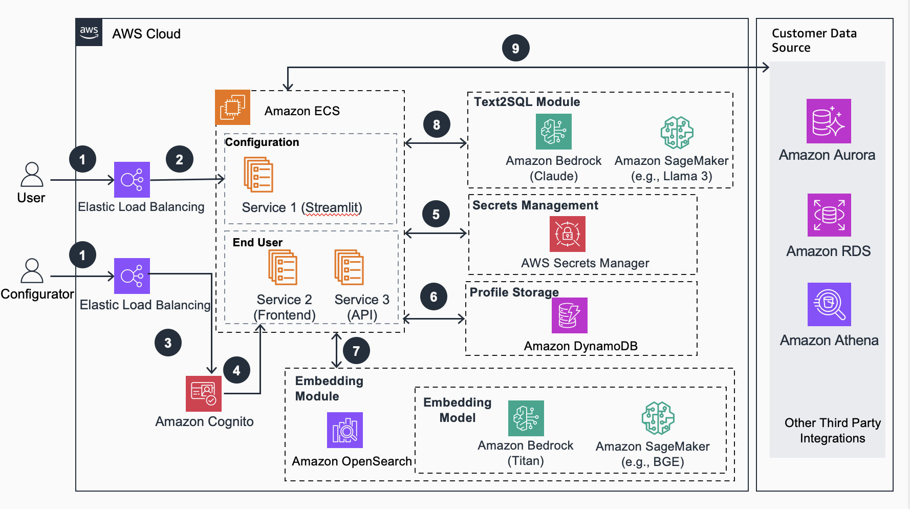

# Guidance for Retail Analytics with Generative AI on AWS

## Introduction

A NLQ(Natural Language Query) guidance using Amazon Bedrock, Amazon OpenSearch with RAG technique for Retail Analytics.




## Table of Content
1. [Overview](#overview)
    - [Cost](#cost)
2. [Prerequisites](#prerequisites)
    - [Operating System](#operating-system)
3. [Deployment Steps](#deployment-steps)
4. [Deployment Validation](#deployment-validation)
5. [Running the Guidance](#running-the-guidance)
6. [Next Steps](#next-steps)
7. [Cleanup](#cleanup)

## Overview
This is a comprehensive framework designed to enable Generative BI capabilities on customized data sources (RDS/Redshift) hosted on AWS. It offers the following key features:
- Text-to-SQL functionality for querying customized data sources using natural language.
- User-friendly interface for adding, editing, and managing data sources, tables, and column descriptions.
- Performance enhancement through the integration of historical question-answer ranking and entity recognition.
- Customize business information, including entity information, formulas, SQL samples, and analysis ideas for complex business problems.
- Add agent task splitting function to handle complex attribution analysis problems.
- Intuitive question-answering UI that provides insights into the underlying Text-to-SQL mechanism.
- Simple agent design interface for handling complex queries through a conversational approach.

### Cost

As of May, 2024, the cost for running this Guidance with the default settings in the _us-west-2_ is approximately $1337.8 per month for processing 2000 requests.

### Sample Cost Table

The following table provides a sample cost breakdown for deploying this Guidance with the default parameters in the US East (N. Virginia) Region for one month.

| AWS service  | Dimensions | Cost [USD] per Month |
| ----------- | ------------ | ------------ |
| Amazon ECS | v0.75 CPU 5GB | $804.1 |
| Amazon DynamoDB | 25 provisioned write & read capacity units per month | $ 14.04 |
| Amazon Bedrock | 2000 requests per month, with each request consuming 10000 input tokens and 1000 output tokens | $ 416.00 |
| Amazon OpenSearch Service | 1 domain with m5.large.search | $ 103.66 |

## Prerequisites

### Operating System
“CDK are optimized to best work to be initiated on **<Amazon Linux 2023 AMI>**.  Deployment in another OS may require additional steps.”

### AWS account requirements

- VPC
- IAM role with specific permissions
- Amazon Bedrock
- Amazon ECS
- Amazon DynamoDB
- Amazon Cognito
- Amazon OpenSearch Service
- Amazon Elastic Load Balancing
- Amazon SageMaker (Optional, if you need customized models to be deployed)
- Amazon Secrets Manager

### Supported Regions

us-west-2, us-east-2, us-east-1, ap-south-1, ap-southeast-1, ap-southeast-2, ap-northeast-1, eu-central-1, eu-west-1, eu-west-3, or any other region that supports the services (bedrock) used in the Guidance.

## Deployment Steps

### 1. Prepare CDK Pre-requisites
Please follow the instructions in the [CDK Workshop](https://cdkworkshop.com/15-prerequisites.html) to install the CDK toolkit. Make sure your environment have the authorization to create the resources.

### 2. Set a password for the Streamlit Web UI

The default password is [Empty] for Streamlit Web UI. If you need to set a password for the Streamlit Web UI, you can update the password in the
```application/config_files/stauth_config.yaml```

for example 

```yaml
credentials:
  usernames:
    jsmith:
      email: jsmith@gmail.com
      name: John Smith
      password: XXXXXX # To be replaced with hashed password
    rbriggs:
      email: rbriggs@gmail.com
      name: Rebecca Briggs
      password: XXXXXX # To be replaced with hashed password
cookie:
  expiry_days: 30
  key: random_signature_key # Must be string
  name: random_cookie_name
preauthorized:
  emails:
  - melsby@gmail.com
```

change the password 'XXXXXX' to hashed password

Use the python code below to generate XXXXXX. We need python 3.8 and up to run the code below:
```python
from streamlit_authenticator.utilities.hasher import Hasher
hashed_passwords = Hasher(['password123']).generate()
```

### 3. Deploy the CDK Stack
For global regions, execute the following commands:

Navigate to the CDK project directory:
```
cd generative-bi-using-rag/source/resources
```
Deploy the CDK stack, change the region to your own region if needed, for example, us-west-2, us-east-1, etc.:
```
export AWS_DEFAULT_REGION=us-west-1
cdk bootstrap
cdk deploy GenBiMainStack
```
You will see the following when deployed succeeded
```
GenBiMainStack.AOSDomainEndpoint = XXXXX.us-west-2.es.amazonaws.com
GenBiMainStack.APIEndpoint = XXXXX.us-west-2.elb.amazonaws.com
GenBiMainStack.FrontendEndpoint = XXXXX.us-west-2.elb.amazonaws.com
GenBiMainStack.StreamlitEndpoint = XXXXX.us-west-2.elb.amazonaws.com
```
## Deployment Validation

Please go to FrontendEndpoint and StreamlitEndpoint to see if the endpoints function well.

## Running the Guidance 

After the CDK stack is deployed, wait around 40 minutes for the initialization to complete. Then, open the Admin Web UI in your browser: https://your-public-dns

1. **Create Data Connection**
   Mainly introduces how to connect to the database.
   - Select the `Data_Connection_Management` page.
   
   - Click `Test Connection` to test the database connection.
   - Click `Add Connection` to create a new database connection.

2. **Background**

   After creating the database connection, you can select different tables from the database to create different Data Profiles.

3. **Create Data Profile**
   - Click `Data_Profile_Management`.
   
     - Fill in the `Data Profile Name`.
     - Select the database connection.
     - Select the relevant data table.
     - Click `Create Data Profile`.

4. **Create Schema Description**
   After creating a Data Profile, to help the large language model better understand the data tables, it is necessary to add relevant descriptions to the schema of the data tables.
   The more detailed the description of the schema, the better. For some fields, try to provide as much detail as possible, including example data, synonyms, operations used in calculations, etc.
   For example:
     - Time field: provide the time format.
     - Boolean field: indicate whether the data is 1/0 or True/False.
   To create a Schema Description:
   - Click `Schema_Description_Management`.

   Table annotation: description of the data table.
   - Name: name of the field (automatically extracted by the system).
   - Datatype: description of the data type of the field (automatically extracted by the system).
   - Comment: explanation of the field, interpretation of the field's meaning.
   - Annotation: synonyms or other notes for the field, example data for the field (including common data examples), and instructions for operations on the field, such as using sum, count, etc.

5. **Modify Prompts**
   For different industries, it is necessary to adjust the Prompts accordingly.

   

   - Intent Prompt
     - Mainly for intent recognition. Currently, there are four main types of intents: knowledge base intent, data query intent, refusal query intent, and chain of thought intent.
   - Knowledge Prompt
     - When a knowledge base intent is recognized, it answers related knowledge base questions. Currently, this is implemented through PE, and later this query can be connected to a knowledge base solution.
   - Text2SQL Prompt
     - The key Prompt for Text2SQL.
   - Data Summary Prompt
     - The main Prompt for data summarization, providing data to the LLM to generate summary text.
   - Data Visualization Prompt
     - Using the LLM to select appropriate visualization charts.
   - Agent Task Prompt
     - Using the understanding ability of the LLM combined with business knowledge to break down complex business problems into multiple dimensional sub-tasks.
   - Agent Data Analyse Prompt
     - For complex business problems, after breaking them down into multiple sub-tasks, each sub-task involves data queries. After the queries are completed, the data and questions are given to the LLM for data analysis.
   - Suggest Question Prompt
     - Generating suggested questions based on the user's query.

6. **Add Business Knowledge**
   Since the large language model may lack relevant industry knowledge, it is necessary to supplement it with relevant business knowledge.

   Add business entity information:
   - Click `Entity_Management`.

   

   - Entity: mainly write the name of the entity.
   - Comment: mainly write the explanation of the entity, such as which field the entity needs to query, what the value of the entity is in the table, the calculation logic of specific formulas, explanations of business names, etc.

   Add sample question SQL information:
   - Click `Index_Management`.

   

   - Question: mainly the user's question.
   - Answer (SQL): mainly the query SQL for the question.

   Add analysis ideas for complex questions:
   - Click `Agent_Cot_Management`.

   

   - Query: user's complex business question.
   - Comment: analysis ideas for the question, in dict structure, where the key is task_1, task_2, ..., and the value is the sub-tasks for the question.

## Cleanup 
- Delete the CDK stack:
```
cdk destroy GenBiMainStack
```
